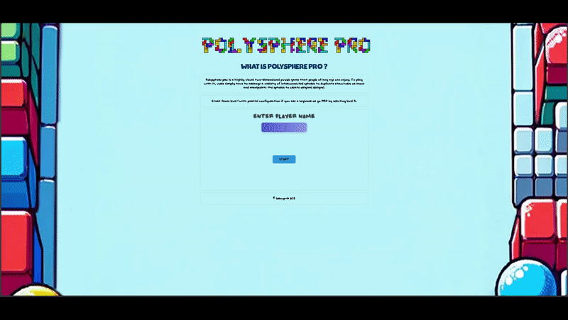
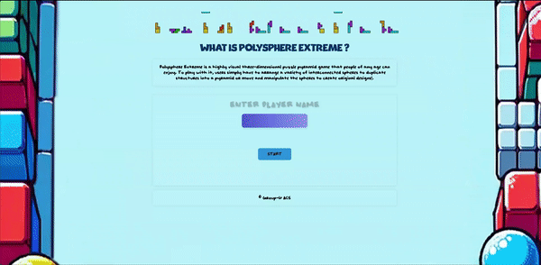

# Puzzle Realms by ASE-Group-6
A web-based portal for various kinds of puzzle games that help improve logical thinking, spatial reasoning and boost cognitive abilities. Built using Django, Python, HTML, and JavaScript.

### Objectives
The portal is designed in order to check various algorithm efficiency and how well it can be optimized when solving puzzle logics at the same time used for entertainment for people of all ages.

### Website
Portal can be accessed from [Puzzle Realms by ASE-Group-6](http://portal.amanthapa.com.np)

### Demo
Short video of the games can be watched from [Demo](https://objectstorage.uk-london-1.oraclecloud.com/p/0bb5W0hwEnplJ7RNQzBcHZhx7DEEzJSlUNvr5kyVnzxL_l7gZ0x1sCKt24ivtAAH/n/lryugqbopb6d/b/thepercyj/o/promo/puzzle-preview.mp4)

### Documentation
- [Project Plan](./Documents/Project-Plan-Grp-6.pdf)
- [Reflective Essay](./Documents/947G5_Group_6_Reflective_Essay.pdf)
- [Technical Documentation](./portal/portal_app/static/portal_app/doc/technical.pdf)

### Code Documentation
- [N-Queens](./portal/portal_app/nqueens_app/html/nqueens_app/index.html)
- [Polysphere Pro](./portal/portal_app/polysphere_app/html/polysphere_app/index.html)
- [Polsyphere Extreme](./portal/portal_app/polysphere3D_app/html/polysphere3D_app/index.html)

### Games
### N-Queens Solver

### Polysphere Pro

### Polysphere Extreme



# Local Installation Guide

Install Visual Studio Code (VSCode):

### Step 1  
Go to the official VSCode [Website](https://code.visualstudio.com/download)
Download the installer for your operating system (Windows, macOS, or Linux).
Run the installer and follow the installation prompts.
Install PyCharm (Optional):

**OR**

If you also want to install PyCharm Community Version, go to the official PyCharm [Website](https://code.visualstudio.com/download)
Download the installer for your operating system.
Run the installer and follow the installation prompts.

### Step 2
Download our project and Extract the Zip Source Folder :
Locate the source folder you want to extract.
Right-click on the folder and choose "Extract" or use a zip utility program to extract the contents.
Open the Project Folder in VSCode:

### Step 3
Install Python Packages from requirements.txt:
Open a terminal or command prompt.
Navigate to the project directory where requirements.txt is located.
Run the following command to install the required packages:
```markdown
pip install -r requirements.txt
```

### Step 4  
Launch VSCode.
Click on "File" in the menu and select "Open Folder".
Navigate to the location where you extracted the source folder, select it, and click "Open".

### Step 5  
Open a terminal within VSCode (click on "Terminal" in the menu, then "New Terminal").
Navigate to the project directory (where manage.py is located).
Run the following command to start the Django server:
```markdown
cd portal ; python manage.py runserver
```
**OR**
```markdown
cd portal ; python manage.py runserver 0.0.0.0: xxxx ( Replace xxxx with any port you want to use to run the server on aside from default 8000)
```

Now open a web browser and browse the following address:
```markdown
http://localhost:8000 or http://127.0.0.1:8000
```
The server should now be running, That's it!!. Enjoy playing !!
